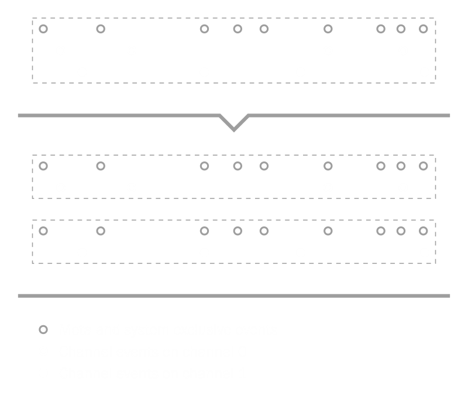
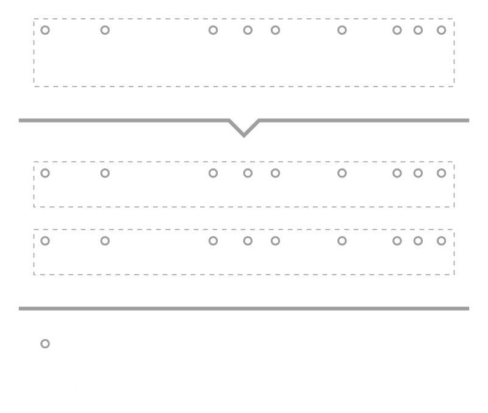
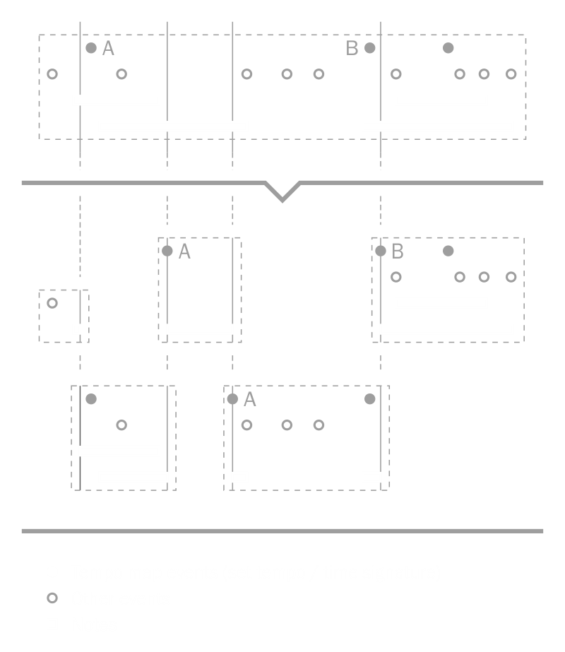
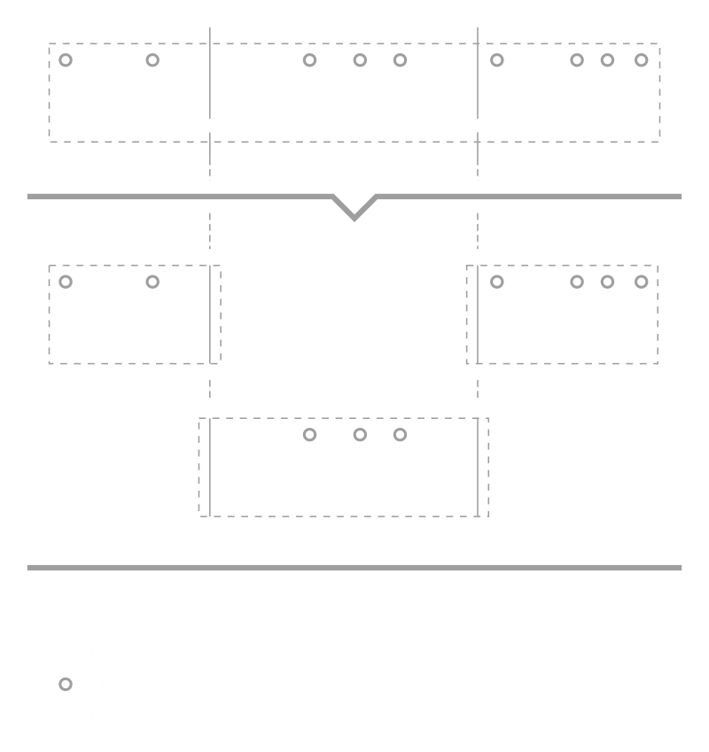
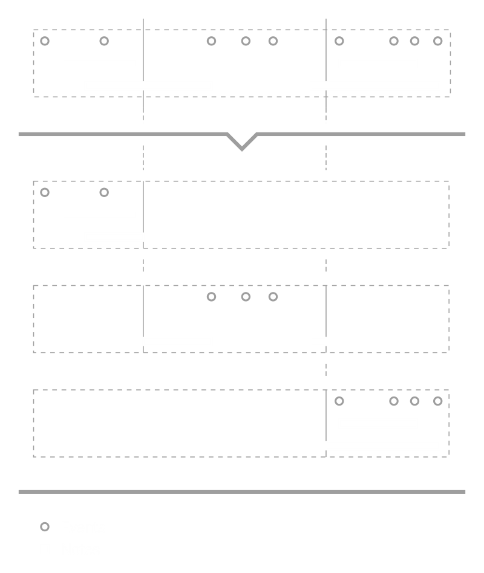
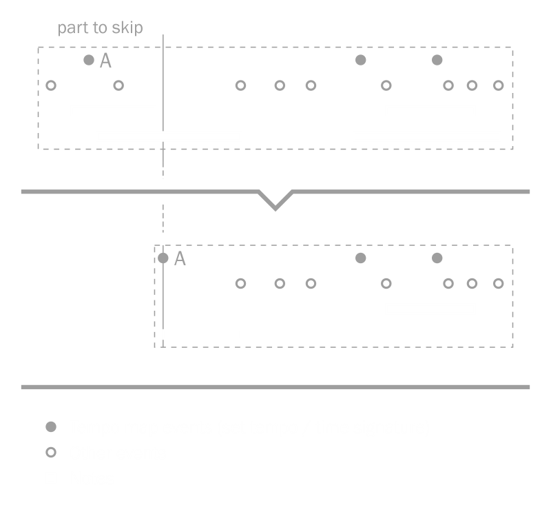
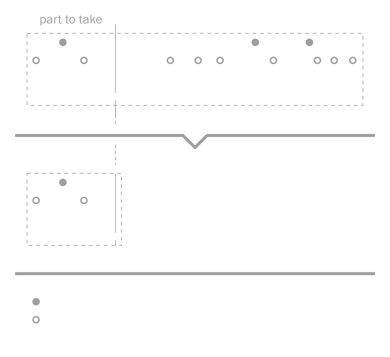
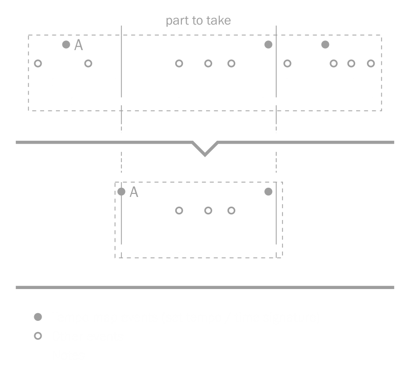

# MIDI file splitter

You can split MIDI file in different ways using extension methods from the [MidiFileSplitter](xref:Melanchall.DryWetMidi.Tools.MidiFileSplitter) class. Available methods of splitting are described below.

> [!IMPORTANT]
> This article doesn't cover all possible methods and their settings. Please read API documentation on [MidiFileSplitter](xref:Melanchall.DryWetMidi.Tools.MidiFileSplitter) to get complete information.

## SplitByChannel

[SplitByChannel](xref:Melanchall.DryWetMidi.Tools.MidiFileSplitter.SplitByChannel*) method splits MIDI file by channel so all [channel events](xref:Melanchall.DryWetMidi.Core.ChannelEvent) will be separated by channel and copied to corresponding new files. All meta and system exclusive events will be copied to all the new files. Non-track chunks will not be copied to any of the new files. Thus each file from the result will contain all meta and sysex events and channel events for single channel. The image below illustrates this process:

## SplitByNotes

[SplitByNotes](xref:Melanchall.DryWetMidi.Tools.MidiFileSplitter.SplitByNotes*) method splits MIDI file by notes. Note events will be separated by note number and copied to corresponding new files. All other channel events, meta and system exclusive events will be copied to all the new files. Non-track chunks will not be copied to any of the new files. The image below illustrates splitting by notes:

## SplitByGrid

[SplitByGrid](xref:Melanchall.DryWetMidi.Tools.MidiFileSplitter.SplitByGrid(Melanchall.DryWetMidi.Core.MidiFile,Melanchall.DryWetMidi.Interaction.IGrid,Melanchall.DryWetMidi.Tools.SliceMidiFileSettings)) method splits MIDI file by the specified grid. Each file will preserve original tempo map. The image below shows general case of splitting a MIDI file by grid:

Splitting can be adjusted via `settings` parameter of the [SliceMidiFileSettings](xref:Melanchall.DryWetMidi.Tools.SliceMidiFileSettings) type. [SplitNotes](xref:Melanchall.DryWetMidi.Tools.SliceMidiFileSettings.SplitNotes) and [PreserveTimes](xref:Melanchall.DryWetMidi.Tools.SliceMidiFileSettings.PreserveTimes) properties described below. All available properties see in documentation for [SliceMidiFileSettings](xref:Melanchall.DryWetMidi.Tools.SliceMidiFileSettings).

### SplitNotes

[SplitNotes](xref:Melanchall.DryWetMidi.Tools.SliceMidiFileSettings.SplitNotes) indicates whether notes should be split in points of grid intersection or not. The default value is `true`. If `false` used, notes treated as just Note On / Note Off events rather than note objects. Splitting notes produces new Note On / Note Off events at points of grid intersecting notes if the property set to `true`. The following image shows splitting by grid if `SplitNotes` set to `false`:

### PreserveTimes

[PreserveTimes](xref:Melanchall.DryWetMidi.Tools.SliceMidiFileSettings.PreserveTimes) indicates whether original times of events should be saved or not. The default value is `false`. If `false` used, events will be moved to the start of a new file. If `true` used, events will be placed in new files at the same times as in the input file. The following image shows splitting in case of `PreserveTimes` set to `true`:

## SkipPart

[SkipPart](xref:Melanchall.DryWetMidi.Tools.MidiFileSplitter.SkipPart(Melanchall.DryWetMidi.Core.MidiFile,Melanchall.DryWetMidi.Interaction.ITimeSpan,Melanchall.DryWetMidi.Tools.SliceMidiFileSettings)) method skips part of the specified length of MIDI file and returns remaining part as an instance of [MidiFile](xref:Melanchall.DryWetMidi.Core.MidiFile). The image below shows general case of skipping a part of a MIDI file:

Splitting can be adjusted via `settings` parameter of the [SliceMidiFileSettings](xref:Melanchall.DryWetMidi.Tools.SliceMidiFileSettings) type.

## TakePart

[TakePart(midiFile, partLength, settings)](xref:Melanchall.DryWetMidi.Tools.MidiFileSplitter.TakePart(Melanchall.DryWetMidi.Core.MidiFile,Melanchall.DryWetMidi.Interaction.ITimeSpan,Melanchall.DryWetMidi.Tools.SliceMidiFileSettings)) and [TakePart(midiFile, partStart, partLength, settings)](xref:Melanchall.DryWetMidi.Tools.MidiFileSplitter.TakePart(Melanchall.DryWetMidi.Core.MidiFile,Melanchall.DryWetMidi.Interaction.ITimeSpan,Melanchall.DryWetMidi.Interaction.ITimeSpan,Melanchall.DryWetMidi.Tools.SliceMidiFileSettings)) methods take part of the specified length of a MIDI file (starting at the start or at the specified time within the file) and return it as an instance of [MidiFile](xref:Melanchall.DryWetMidi.Core.MidiFile). The image below shows both cases of taking a part of a MIDI file:

Splitting can be adjusted via `settings` parameter of the [SliceMidiFileSettings](xref:Melanchall.DryWetMidi.Tools.SliceMidiFileSettings) type.